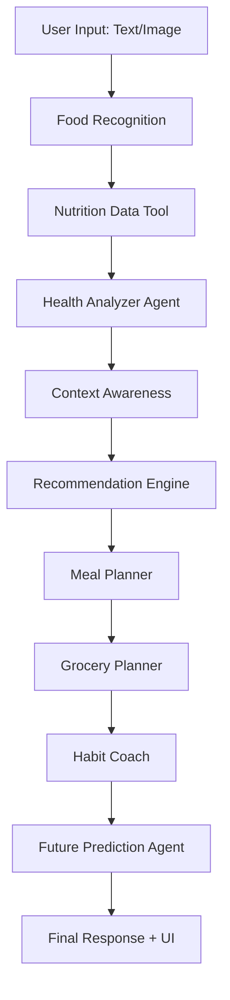

# 🧠 NutriMind AI – Smart Food & Health Companion

> 🚀 *“NutriMind AI doesn’t just track your diet — it predicts your future health and helps you improve it.”*

---

## 🌟 Overview

**NutriMind AI** is a next-generation food and health application powered by a **multi-agent AI system**. It helps users make better food choices, track their health dynamically, and build sustainable eating habits using **real-world nutrition data, contextual awareness, and predictive intelligence**.

---

## 🎯 Key Features

- 🧠 **Multi-Agent AI System**
  - Nutrition Expert
  - Health Analyzer
  - Meal Planner
  - Grocery Planner
  - Habit Coach
  - 🔮 *Future Prediction Agent (Killer Feature)*

- 📊 **Dynamic Health Score (0–100)**
- 📸 **Food Image Scanner (AI-powered)**
- 🍽️ **Personalized Meal Planning**
- 🛒 **Smart Grocery List Generator**
- 🔁 **Habit Tracking & Streak System**
- ⚡ **Context-Aware Recommendations (time, mood, activity)**
- 🔮 **Future Health Simulator (What-if Engine)**

---

## 🏗️ Tech Stack

### 🎨 Frontend
- ⚛️ React (Vite)
- 🎨 Tailwind CSS
- 📊 Recharts (Data Visualization)

### ⚙️ Backend
- 🐍 FastAPI
- 🔗 REST APIs (MCP-style tools)
- 🗄️ SQLite (Persistent Storage)

### 🧠 AI / ML
- 🤖 Google Gemini (via google-genai)
- 📸 Gemini Vision (Image Analysis)

### 🌐 APIs
- 🥗 Edamam API
- 🍎 USDA FoodData Central API (fallback)

---

## 🏛️ Architecture
Frontend (React + Tailwind)
        ↓
FastAPI Backend (API Layer)
        ↓
Multi-Agent System (Orchestrator)
        ↓
MCP Tools Layer (APIs & Services)
        ↓
Database (SQLite)

### 📁 Project Structure
NutriMind-AI/
│
├── frontend/ # React + Tailwind UI
│ ├── src/pages/
│ ├── src/components/
│ └── src/services/
│
├── backend/
│ ├── api/ # REST endpoints
│ ├── agents/ # AI agents
│ ├── tools/ # MCP tools
│ ├── database/ # SQLite models
│ ├── workflow.py # Orchestrator
│ └── main.py # FastAPI entry
│
└── README.md

---

## 🔁 Workflow

## Backend Setup (FastAPI)
cd backend
python -m venv venv
venv\Scripts\activate   # Windows
pip install -r requirements.txt

uvicorn main:app --reload

## Frontend setup
cd frontend
npm install
npm run dev
